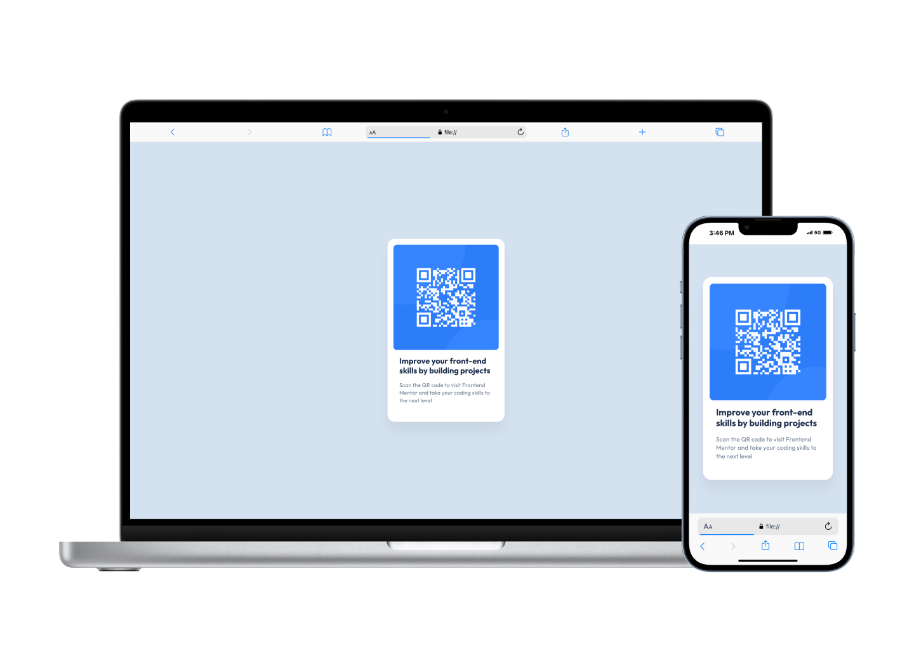

# Frontend Mentor - QR code component solution

This is a solution to the [QR code component challenge on Frontend Mentor](https://www.frontendmentor.io/challenges/qr-code-component-iux_sIO_H). Frontend Mentor challenges help you improve your coding skills by building realistic projects. 

## Overview

### Screenshot

### Links

- Solution URL: [GitHub Page](https://css-ninja.github.io/qr-code-component-main/)

### Built with

- Semantic HTML5 markup
- CSS custom properties (variables)
- Flexbox

### Continued development

### Useful resources

- [A Modern CSS Reset](https://www.joshwcomeau.com/css/custom-css-reset/) - This project uses a css reset created by Josh Comeau.

## Author

- Website - [https://chriscifonie.com/](https://chriscifonie.com/)
- Frontend Mentor - [@css-ninja](https://www.frontendmentor.io/profile/css-ninja)
